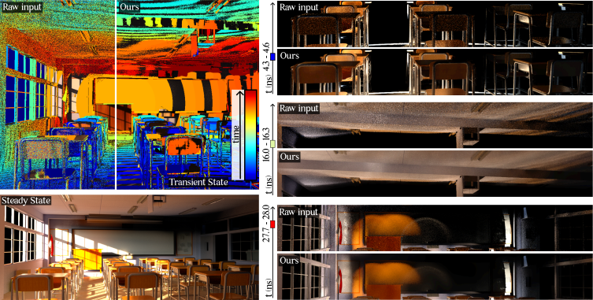

# Statistical Denoising of Transient Rendering

<p align="center">
  
</p>

We expand the statistical framework for Monte Carlo rendering of [Sakai et al.](https://users.cg.tuwien.ac.at/%7Ehiroyuki/StatMC/) to the transient rendering state, using spatio-temporal kernels that exploit the spatio-temporal correlation of light.
This framework collects statistics throughout the rendering process and creates a membership function for deciding which pixels to combine.

## Code Components

This implementation includes:

- **Statistics Collection**: `external/statmitransient` — Collects statistics through the transient render process. This code builds on the [mitransient repository](https://github.com/diegoroyo/mitransient).
- **Denoising Module**: `denoisers/statTransientDenoiser.py` — Performs denoising using the collected statistics, video data, and G-buffers.

## Installation

### Statmitransient

```bash
git submodule update --init --recursive
```

This clones the statmitransient submodule which implements the code for collecting statistics through the render process

### Create the Python Environment

```bash
./local_install.sh
source .venv/bin/activate
```

This creates a `.venv` environment with all required dependencies.

## Testing

We provide `example.ipynb`, which demonstrates the full pipeline:

1. Renders a noisy transient scene
2. Denoises it using our method and OptiX
3. Renders the same scene with more samples for comparison
4. Compares results using RMSE, SSIM, and FLIP metrics
